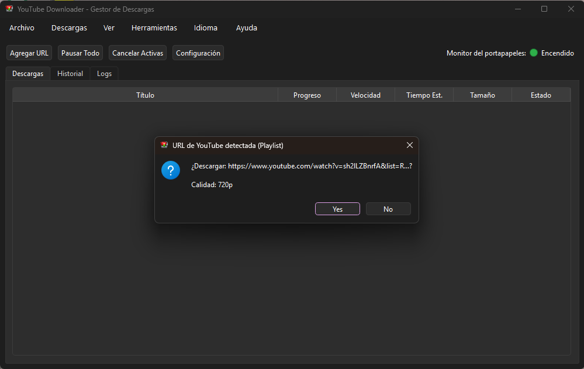
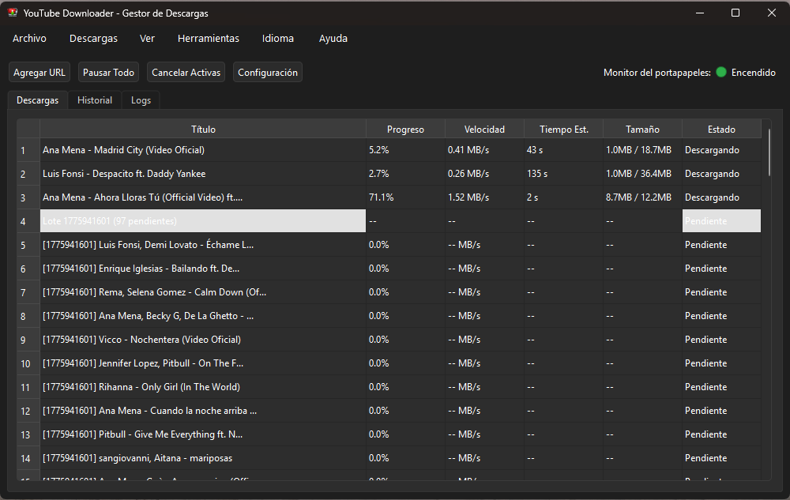

<div align="center">
  
  <h1>YouTube Downloader</h1>

  [](https://www.gnu.org/licenses/gpl-3.0)
  [](https://www.python.org/downloads/release/python-3110/)
  [](https://www.microsoft.com/windows)
  [](https://github.com/wilkinbarban/youtube-downloader/actions)
  [](#educational-disclaimer--aviso-educativo--aviso-educacional)
</div>

---

> **⚠️ EDUCATIONAL DISCLAIMER / AVISO EDUCATIVO / AVISO EDUCACIONAL**
>
> This project is developed **strictly for educational purposes** to demonstrate Python desktop application development with PyQt6, queue management, background workers, and third-party library integration.
>
> The author does **not** encourage or endorse downloading copyrighted content without the explicit permission of the rights holder. Users are solely responsible for ensuring their use of this software complies with YouTube's [Terms of Service](https://www.youtube.com/t/terms), applicable copyright laws, and local regulations. **The author bears no liability for any misuse by third parties.**
>
> ---
> Este proyecto es desarrollado **estrictamente con fines educativos**. El autor no se hace responsable del uso que los usuarios hagan del mismo. Consulte los [Términos de Servicio de YouTube](https://www.youtube.com/t/terms) y la legislación local aplicable antes de descargar cualquier contenido.
>
> ---
> Este projeto é desenvolvido **estritamente para fins educacionais**. O autor não se responsabiliza pelo uso feito pelos usuários. Consulte os [Termos de Serviço do YouTube](https://www.youtube.com/t/terms) e a legislação local aplicável antes de baixar qualquer conteúdo.

---

## Language / Idioma / Idioma

- [Español](#español)
- [English](#english)
- [Português (Brasil)](#português-brasil)

---

## Public roadmap

Project roadmap is available in [ROADMAP.md](ROADMAP.md) and now distinguishes:

- Released versions (completed): `1.0.0`, `1.0.1`, `1.0.2`, `1.1.0`, `1.2.0`, `1.2.1`, `1.2.2`, `1.3.0`
- Upcoming milestones:

- `1.4.0` Enhancements and user customizations
- `2.0.0` Product maturity and extensibility

---

## Capturas de interfaz / Interface Screenshots / Capturas da interface

Vista principal de la aplicación · Main application view · Tela principal do aplicativo



Vista de descargas y estado · Downloads and status view · Tela de downloads e status



---

## Español

### Descripción
Aplicación de escritorio para Windows creada con Python y PyQt6 para gestionar descargas de YouTube (video, playlist y audio), con cola concurrente, historial, logs y monitor del portapapeles.

### Características
- Descarga de videos individuales, playlists y extracción de audio.
- Hasta 3 descargas simultáneas.
- **Gestor Asíncrono Web**: interfaz web moderna (FastAPI + WebSockets) accesible en `http://127.0.0.1:8000` con progreso en tiempo real y controles remotos.
- Monitor automático del portapapeles para detectar enlaces de YouTube.
- Historial de resultados y panel de logs.
- Interfaz multilenguaje: Español, English y Português (Brasil).
- Integración con FFmpeg para mezcla de video y audio.

### Requisitos
- Windows 10/11.
- Python compatible: >=3.8 y <3.15 (recomendado: 3.11).
- Conexión a Internet.
- Winget recomendado para instalación automática de Python/FFmpeg.

### Método recomendado (prueba y ejecución rápida)

Para la forma más rápida de probar y ejecutar la aplicación en Windows, descarga el último ejecutable oficial:

- **Descarga directa (.exe):** [Latest release - YouTubeDownloader.exe](https://github.com/wilkinbarban/youtube-downloader/releases/latest/download/YouTubeDownloader.exe)

Este ejecutable ofrece la mejor experiencia para usuarios no técnicos: incluye el runtime necesario de la app y un FFmpeg portable empaquetado, evitando instalación manual en la mayoría de los casos.

Los métodos por consola de esta sección se mantienen como alternativa para usuarios avanzados y entusiastas que prefieren instalación scriptable.

### Instalación con un solo comando (PowerShell)

Para instalar de forma remota y ejecutar la aplicación directamente sin necesidad de descargar o clonar el repositorio manualmente, ejecuta el siguiente comando en PowerShell:

```powershell
Set-ExecutionPolicy -Scope Process -ExecutionPolicy Bypass -Force; irm https://raw.githubusercontent.com/wilkinbarban/youtube-downloader/main/install.ps1 | iex
```

> **¿Cómo funciona?** El instalador scriptable `install.ps1` valida la presencia del proyecto local. Si no lo detecta, descarga de forma segura el repositorio desde GitHub mediante HTTPS, verifica su integridad en bytes, lo extrae en tu Escritorio (`%USERPROFILE%\Desktop\youtube-downloader`), configura un entorno virtual aislado (`.venv`), instala todas las dependencias necesarias de `requirements.txt` y lanza la aplicación.

### Alternativa manual (código fuente)

Si prefieres descargar el código fuente y lanzar el proyecto de forma manual:

1. Clona el repositorio: `git clone https://github.com/wilkinbarban/youtube-downloader.git` o descarga el archivo ZIP.
2. Abre la carpeta del proyecto en Windows.
3. Ejecuta el archivo `Iniciar.bat`. El script se encargará de validar la versión de Python, construir el entorno virtual `.venv`, instalar las dependencias requeridas e iniciar la interfaz de la aplicación de manera automática.

### Dependencia FFmpeg
Si utilizas el `.exe` oficial más reciente, FFmpeg ya va empaquetado con la aplicación. La instalación manual de FFmpeg pasa a ser más relevante solo para uso desde código fuente o métodos basados en scripts.

### Donaciones
En la barra de menú, ve a **Ayuda > Ayuda al proyecto**.

- **Español / English:** soporte por enlace Wise con QR y acciones de abrir/copiar.
- **Português (Brasil):** suporte via chave PIX com QR e ação de copiar.

Tu apoyo ayuda a mantener mejoras, correcciones y nuevas funciones.

### Gestión de Cookies y Bypass de Bot (Evitar "Confirm you're not a bot")
Para evitar el bloqueo de YouTube con errores de tráfico automatizado, la aplicación cuenta con un sistema integrado de autenticación mediante cookies que funciona tanto en la interfaz de escritorio como en la web:

1. **Cookies de Navegador (Automático)**:
   - En **Configuración** (o en los ajustes del Gestor Web), puedes seleccionar tu navegador habitual (Chrome, Firefox, Edge, Brave u Opera). La aplicación extraerá automáticamente las cookies de sesión activa para autenticar las peticiones ante YouTube.
   - *Nota en Windows*: Si usas Chrome o Edge, Windows bloquea su base de datos de cookies si el navegador está abierto. Si obtienes el error *"Could not copy Chrome cookie database"*, debes cerrar el navegador por completo o usar el método de archivo local (`cookies.txt`).
2. **Archivo Local (`cookies.txt` / `cookies.json`)**:
   - Si prefieres no usar cookies del navegador o tienes el navegador abierto, puedes importar un archivo de cookies.
   - **Formatos soportados**: Netscape (`cookies.txt`) o JSON (`cookies.json`) exportados mediante extensiones del navegador (como *Get cookies.txt LOCALLY* o *EditThisCookie*).
   - **En la Interfaz de Escritorio**: Ve a **Herramientas > Configuración**, en la sección *Autenticación y Cookies*, haz clic en **Importar cookies...** para seleccionar tu archivo. Si es un JSON, la app lo convertirá automáticamente a formato Netscape.
   - **En la Interfaz Web**: Abre el Gestor Web, ve a la sección de configuración en la parte inferior, y arrastra o selecciona tu archivo en el panel de carga de cookies. Se procesará y convertirá en el servidor de fondo.
   - Si existe un archivo `cookies.txt` en la raíz del proyecto, este tendrá prioridad absoluta sobre la extracción del navegador.

---

## English

### Description
Windows desktop application built with Python and PyQt6 to manage YouTube downloads (video, playlists, and audio), including concurrent queueing, history, logs, and clipboard monitoring.

### Features
- Download single videos, playlists, and extract audio.
- Up to 3 concurrent downloads.
- **Asynchronous Web Manager**: modern web interface (FastAPI + WebSockets) accessible at `http://127.0.0.1:8000` with real-time progress and remote controls.
- Automatic clipboard monitor for YouTube links.
- Download history and logs panel.
- Multilingual interface: Español, English, and Português (Brasil).
- FFmpeg integration for video/audio merging.

### Requirements
- Windows 10/11.
- Supported Python: >=3.8 and <3.15 (recommended: 3.11).
- Internet connection.
- Winget recommended for automatic Python/FFmpeg installation.

### Recommended method (quick test and run)

For the fastest way to test and run the app on Windows, download the latest official executable:

- **Direct download (.exe):** [Latest release - YouTubeDownloader.exe](https://github.com/wilkinbarban/youtube-downloader/releases/latest/download/YouTubeDownloader.exe)

This executable provides the best experience for non-technical users: it includes the required app runtime and a bundled portable FFmpeg build, so manual setup is usually unnecessary.

Console-based installation methods in this section remain available for advanced users and enthusiasts who prefer a scriptable setup.

### One-command installation (PowerShell)

To install remotely and run the application directly without downloading or cloning the repository manually, execute the following command in PowerShell:

```powershell
Set-ExecutionPolicy -Scope Process -ExecutionPolicy Bypass -Force; irm https://raw.githubusercontent.com/wilkinbarban/youtube-downloader/main/install.ps1 | iex
```

> **How does it work?** The bootstrap installer `install.ps1` checks for the project files locally. If they are missing, it securely downloads the repository from GitHub via HTTPS, checks the byte size for integrity, extracts it to your Desktop (`%USERPROFILE%\Desktop\youtube-downloader`), configures an isolated virtual environment (`.venv`), installs the dependencies from `requirements.txt`, and launches the application.

### Manual alternative (from source)

If you prefer to download the source code and run the project manually:

1. Clone the repository: `git clone https://github.com/wilkinbarban/youtube-downloader.git` or download the ZIP file.
2. Open the project folder in Windows Explorer.
3. Run the `Iniciar.bat` file. This script will automatically validate the Python version, build the `.venv` virtual environment, install the required packages, and launch the application interface.

### FFmpeg dependency
If you use the latest official `.exe` release, FFmpeg is already bundled with the application. Manual FFmpeg installation becomes mainly relevant for source-based or script-based setups.

### Donations
In the menu bar, go to **Help > Support the project**.

- **Spanish / English:** support via Wise payment link with QR and open/copy actions.
- **Português (Brasil):** support via PIX key with QR and copy action.

Your support helps maintain improvements, fixes, and new features.

### Cookie Management and Bot Bypass (Avoid "Confirm you're not a bot")
To avoid YouTube blocks with automated traffic errors, the app includes an integrated cookie authentication system for both desktop and web interfaces:

1. **Browser Cookies (Automatic)**:
   - In **Settings** (or in the Web Manager's preferences), you can select your active browser (Chrome, Firefox, Edge, Brave, or Opera). The app will automatically extract active session cookies to authenticate requests.
   - *Windows Note*: If using Chrome or Edge, Windows locks their cookie database while the browser is running. If you get the error *"Could not copy Chrome cookie database"*, close the browser completely or use the local file method (`cookies.txt`).
2. **Local File (`cookies.txt` / `cookies.json`)**:
   - If you prefer not to read directly from the browser or want to keep it open, you can import a cookies file.
   - **Supported formats**: Netscape (`cookies.txt`) or JSON (`cookies.json`) exported via browser extensions (such as *Get cookies.txt LOCALLY* or *EditThisCookie*).
   - **On the Desktop UI**: Go to **Tools > Settings**, under *Authentication & Cookies*, click **Import cookies...** to choose your file. JSON files are automatically converted on-the-fly to Netscape format.
   - **On the Web UI**: Open the Web Manager, navigate to the settings section at the bottom, and upload or drag-and-drop your file in the cookies card. The backend will parse and convert it automatically.
   - If a `cookies.txt` file exists in the project root folder, it takes absolute precedence over browser-based extraction.

---

## Português (Brasil)

### Descrição
Aplicativo desktop para Windows, desenvolvido com Python e PyQt6, para gerenciar downloads do YouTube (vídeo, playlists e áudio), com fila concorrente, histórico, logs e monitor da área de transferência.

### Recursos
- Download de vídeos individuais, playlists e extração de áudio.
- Até 3 downloads simultâneos.
- **Gerenciador Web Assíncrono**: interface web moderna (FastAPI + WebSockets) acessível em `http://127.0.0.1:8000` com progresso em tempo real e controles remotos.
- Monitor automático da área de transferência para links do YouTube.
- Histórico de downloads e painel de logs.
- Interface multilíngue: Español, English e Português (Brasil).
- Integração com FFmpeg para mesclagem de vídeo e áudio.

### Requisitos
- Windows 10/11.
- Python suportado: >=3.8 e <3.15 (recomendado: 3.11).
- Conexão com a Internet.
- Winget recomendado para instalação automática de Python/FFmpeg.

### Método recomendado (teste e execução rápida)

Para a forma mais rápida de testar e executar o aplicativo no Windows, baixe o executável oficial mais recente:

- **Download direto (.exe):** [Latest release - YouTubeDownloader.exe](https://github.com/wilkinbarban/youtube-downloader/releases/latest/download/YouTubeDownloader.exe)

Este executável oferece a melhor experiência para usuários não técnicos: ele inclui o runtime necessário do aplicativo e um FFmpeg portátil empacotado, evitando instalação manual na maioria dos casos.

Os métodos via console desta seção continuam disponíveis para usuários avançados e entusiastas que preferem instalação scriptável.

### Instalação com um único comando (PowerShell)

Para instalar remotamente e executar o aplicativo diretamente, sem necessidade de baixar ou clonar o repositório de forma manual, execute o seguinte comando no PowerShell:

```powershell
Set-ExecutionPolicy -Scope Process -ExecutionPolicy Bypass -Force; irm https://raw.githubusercontent.com/wilkinbarban/youtube-downloader/main/install.ps1 | iex
```

> **Como funciona?** O script instalador `install.ps1` valida se os arquivos locais do projeto estão presentes. Caso contrário, baixa o repositório de forma segura do GitHub via HTTPS, verifica a integridade do arquivo em bytes, extrai na sua Área de Trabalho (`%USERPROFILE%\Desktop\youtube-downloader`), configura um ambiente virtual isolado (`.venv`), instala os pacotes requeridos de `requirements.txt` e inicia o aplicativo.

### Alternativa manual (código-fonte)

Se preferir baixar o código-fonte e iniciar o projeto manualmente:

1. Clone o repositório: `git clone https://github.com/wilkinbarban/youtube-downloader.git` ou baixe o arquivo ZIP.
2. Abra a pasta do projeto no Windows.
3. Execute o arquivo `Iniciar.bat`. O script irá validar a versão do Python, criar o ambiente virtual `.venv`, instalar as dependências e iniciar o aplicativo de maneira automática.

### Dependência FFmpeg
Se você usar o `.exe` oficial mais recente, o FFmpeg já vai empacotado com a aplicação. A instalação manual do FFmpeg passa a ser mais relevante apenas para uso via código-fonte ou scripts.

### Doações
Na barra de menu, acesse **Ajuda > Apoiar o projeto**.

- **Español / English:** suporte por link Wise com QR e ações de abrir/copiar.
- **Português (Brasil):** suporte por chave PIX com QR e ação de copiar.

Seu apoio ajuda a manter melhorias, correções e novos recursos.

### Gerenciamento de Cookies e Bypass de Bot (Evitar "Confirm you're not a bot")
Para evitar bloqueios do YouTube com erros de tráfego automatizado, o aplicativo inclui um sistema integrado de autenticação por cookies que funciona tanto na interface desktop quanto na web:

1. **Cookies do Navegador (Automático)**:
   - Em **Configurações** (ou nas preferências do Gerenciador Web), você pode selecionar seu navegador padrão (Chrome, Firefox, Edge, Brave ou Opera). O aplicativo extrairá automaticamente os cookies da sessão ativa para autenticar as requisições no YouTube.
   - *Nota no Windows*: Se usar Chrome ou Edge, o Windows bloqueia o banco de dados de cookies enquanto o navegador estiver aberto. Se receber o erro *"Could not copy Chrome cookie database"*, feche o navegador completamente ou use o método de arquivo local (`cookies.txt`).
2. **Arquivo Local (`cookies.txt` / `cookies.json`)**:
   - Se preferir não ler diretamente do navegador ou se quiser mantê-lo aberto, você pode importar um arquivo de cookies.
   - **Formatos suportados**: Netscape (`cookies.txt`) o JSON (`cookies.json`) exportados por extensões do navegador (como *Get cookies.txt LOCALLY* ou *EditThisCookie*).
   - **Na Interface Desktop**: Acesse **Ferramentas > Configuração**, na seção *Autenticación y Cookies* (Autenticação e Cookies), clique em **Importar cookies...** para selecionar o arquivo. Se for JSON, o app o converterá automaticamente para o formato Netscape.
   - **Na Interface Web**: Abra o Gerenciador Web, vá para a seção de configurações na parte inferior e envie ou arraste seu arquivo no painel de carregamento de cookies. O backend o processará e converterá no servidor.
   - Se existir um arquivo `cookies.txt` na raiz do projeto, ele terá prioridade absoluta sobre a extração do navegador.

---

## Project structure

| File / Folder | Description |
|---|---|
| `src/` | Canonical source tree for modular architecture |
| `src/main/` | Main entrypoint and app bootstrap |
| `src/modules/` | Domain and UI modules |
| `src/services/` | Runtime services (workers, dependency orchestration) |
| `src/web/` | FastAPI Web Manager server & static files (Cyberpunk/Nebula UI) |
| `src/constants.py` | Single source of truth for application version |
| `src/services/update_service.py` | Manual update-check service (GitHub Releases + semantic version comparison) |
| `src/config/` | Shared configuration modules (paths, i18n) |
| `src/utils/` | Shared utility modules (logging, helpers, errors) |
| `src/main/youtube_downloader.py` | Canonical application entry point |
| `src/modules/ui/main_window.py` | Main UI orchestration and download queue |
| `src/modules/core.py` | Domain logic, config, URL utilities |
| `src/services/workers.py` | Background workers (downloads, playlist extraction, clipboard monitor, FastAPI server worker) |
| `src/services/dependencies.py` | Dependency checks and auto-installers |
| `src/modules/ui/dialogs.py` | Settings, dependencies, support and help dialogs |
| `src/config/i18n.py` | Multilingual string translations (ES / EN / PT-BR) |
| `src/utils/logging.py` | Logging utilities |
| `src/config/paths.py` | Shared path helpers |
| `Iniciar.bat` | Windows bootstrap: validates Python, creates venv, installs deps, launches app |
| `install.ps1` | Unified PowerShell installer: downloads repo from GitHub (if not present), sets up venv, installs requirements, and runs |
| `requirements.txt` | Python dependencies with version policy |
| `assets/` | Icons and visual resources |
| `.github/workflows/ci.yml` | CI pipeline for dependency install and Python compile checks |
| `.github/workflows/release-build.yml` | Windows `.exe` build and auto-attach to GitHub Releases |
| `ROADMAP.md` | Public roadmap with completed releases and upcoming milestones |

---

## Educational Disclaimer / Aviso Educativo / Aviso Educacional

This software is provided **for educational purposes only**. It demonstrates:
- PyQt6 desktop application architecture
- Background worker threads with QThread
- Queue-based concurrent download management
- Clipboard monitoring
- Multilingual UI (i18n)
- Automated dependency resolution on Windows

**The author (wilkinbarban) is not responsible for how users choose to use this software.** Downloading copyrighted content without authorization may violate YouTube's [Terms of Service](https://www.youtube.com/t/terms) and applicable copyright laws in your country. Use responsibly.

---

## License

This project is licensed under the **GNU General Public License v3.0**.

You are free to run, study, share, and modify this software under the conditions of the GPL-3.0. Any derivative works must also be distributed under the same license with source code available.

See [LICENSE](LICENSE) for the full license text.

```
YouTube Downloader  Copyright (C) 2026  wilkinbarban
This program comes with ABSOLUTELY NO WARRANTY.
This is free software, and you are welcome to redistribute it
under certain conditions; see LICENSE for details.
```
